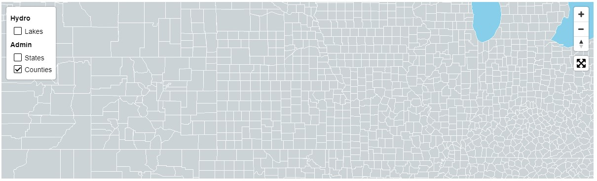

# mapbox-layer-control

#### [Grouped Demo](https://reyemtm.github.io/mapbox-layer-control/example/grouped.html) experimental

#### [Simple Demo](https://reyemtm.github.io/mapbox-layer-control/example/simple.html)

*This is very much in development. Any assistance is appreciated. This is inspired by the Gartrell Group mapbox legend control.*

This is a simple layer control for Mapbox GL JS maps. The layers need to already exist in the map. Each layer should only be added once to the control. The control does not control map layer indexing. The layers should be added to the control in the opposite order that they have been added to the map. The control simply adjusts the visibility layout property of the layer. In the grouped control, the group name toggles all the layers in the group. The control can have hidden layers that get toggled just like other layers. Layers can have a very basic legend written in HTML.

To Do:


* [ ] ADD DOCUMENTATION
* [ ] ADD CSS FRAMEWORK STYLING FOR TOGGLES
* [ ] STYLE COLLAPSIBLE GROUP HEADINGS WITH HEIGHT TRANSITIONS
* [ ] MOVE STYLES TO STYLESHEET
* [ ] DECIDE ON LEGEND PLACEMENT VS HIDDEN LAYER PLACEMENT
* [ ] ADD TOGGLE ICON, COLLAPSIBLE ICON AND COLLAPSIBLE METHOD TO GROUP HEADING FOR HIDDEN LAYERS
* [ ] ACCESSIBILITY FOR HIDDEN LAYERS, LAYER HEADINGS AND DIRECTORY HEADINGS???
* [ ] FIX WEIRD SELECTION BUG WHEN CLICK HEADING AND MOUSEOUT
* [ ] FIX HOVER/COLLAPSED EFFECT ON MOBILE
* [x] ADD HIDDEN LAYERS
* [x] ADD LEGEND ITEMS
* [x] ADD COLLAPSIBLE DIRECTORY HEADINGS





```javascript
map.addControl( new layerControlSimple({
  layers: ["Lakes", "States", "Counties"]
}), "top-left");

map.addControl( new layerControlGrouped({
  layers: [
    {
      name: "Transportation",
      directory: "Cultural",
      mapLayers: [
        {
        "name": "Rail",
        "id": "Rail",
        "legend": "<i class='fa fa-minus' style='color:black;'>&nbsp;</i>Railroads"
        }
      ]
    },
    {
      name: "Hydro",
      directory: "Environment",
      "legend": `
          <i class='fa fa-square' style='color:blue;'>&nbsp;</i>Lakes<br>
          <i class='fa fa-minus' style='color:blue;'>&nbsp;</i>Rivers
          `,
      mapLayers: [
        {
        "name": "Lakes",
        "id": "Lakes",
        "legend": `
          <i class='fa fa-square' style='color:blue;'>&nbsp;</i>Lakes<br>
          `,
        },
        {
          "name": "Rivers",
          "id": "rivers",
          "group": "rivers",
          "legend": `
          <i class='fa fa-minus' style='color:blue;'>&nbsp;</i>Rivers<br>
          `         
        },
        {
          "name": "",
          "id": "riversCase",
          "hidden": true,
          "group": "rivers"
        },
      ]
    },
    {          
      name: "Admin",
      directory: "Administrative",
      mapLayers: [{
        "name": "States",
        "id": "States",
        },
        {
          "name": "Counties",
          "id": "Counties"
        }
      ]
    }
  ]
}), "top-left");
```
Data is from [Natural Earth](https://www.naturalearthdata.com/) and [here](https://eric.clst.org/tech/usgeojson/).
