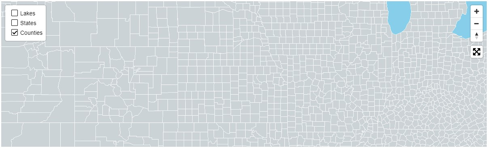

# mapbox-layer-control


#### [Grouped Demo](https://reyemtm.github.io/mapbox-layer-control/example/grouped.html?rivers=true&riversCase=true&States=true&Counties=true#4.11/38.61/-96.05)

#### [Simple Demo](https://reyemtm.github.io/mapbox-layer-control/example/simple.html)

*This is very much in development and may change without notice.*

*Update 10/22/2020*

A simple filter control has been added, with multiple filters allowed per layer. If multiple filters are used, all conditions must be met. Add a ``filterSchema`` to the layer metadata, where the first object is the name of the field to be filtered, and the type being the type of filter. Available types are string, date, number, and select (single). 

**The filter form uses Spectre CSS for styling.**

### String Filter

```JavaScript
{
  id: "States",
  hidden: false,
  group: "Political",
  directory: "Admin",
  metadata: {
    filterSchema: {
      "NAME": {
      type: "string"
      }
    }
  }
}
```

### Date Filter
*Date and number filters have operators added automatically.*
```JavaScript
{
  id: "Roads",
  metadata: {
    filterSchema: {
      last_major_work_date: {
        type: "date"
      }
    }
  }
}
```

### Select Filter

```JavaScript
{
  id: "Zoning",
  metadata: {
    filterSchema: {
      zoning_code: {
        type: "select",
        options: ["", "RS-1","RS-2","RS-3","PUD"]  
      }
    }
  }
}
```


This is a simple layer control for Mapbox GL JS maps inspired by the Gartrell Group legend control. The layers need to already exist in the map. Each layer should only be added once to the control. The control does not control map layer indexing. The layers should be added to the control in the same order that they have been added to the map (meaning the top layer is added last). The control simply adjusts the visibility layout property of the layer. In the grouped control, the group name toggles all the layers in the group. The control can have hidden layers that get toggled just like other layers. Layers have legends added automatically if they are a line, circle or fill with a single color. They can also have legend written in HTML.

Ideally one would add the operational layers to the map and the layers to this control with a master layer config JSON file. The control will also add url parameters for any layers turned on, allowing the map state to be shared. If this functionality is desired it is best to leave all layers off initially and let the control turn them on with query parameters, as this function will not turn off layers that are initially visible.

**Legends use font-awesome.**

To Do:

* [ ] ADD DOCUMENTATION
* [ ] FIX WEIRD SELECTION BUG WHEN CLICK HEADING AND MOUSEOUT
* [ ] FIX HOVER/COLLAPSED EFFECT ON MOBILE
* [ ] ~~ADD CSS FRAMEWORK STYLING FOR TOGGLES~~
* [X] ADD TOGGLE ICON, COLLAPSIBLE ICON AND COLLAPSIBLE METHOD TO GROUP HEADING FOR HIDDEN LAYERS
* [X] ADD ICON WITH COUNT OF ACTIVE LAYERS FOR GROUPS AND DIRECTORIES
* [X] STYLE COLLAPSIBLE GROUP HEADINGS WITH HEIGHT TRANSITIONS
* [X] MOVE STYLES TO STYLESHEET
* [X] DECIDE ON LEGEND PLACEMENT VS HIDDEN LAYER PLACEMENT
* [x] ADD HIDDEN LAYERS
* [x] ADD LEGEND ITEMS
* [x] ADD COLLAPSIBLE DIRECTORY HEADINGS



```javascript
map.addControl( new layerControlSimple({
  layers: ["Lakes", "States", "Counties"]
}), "top-left");
```
Data is from [Natural Earth](https://www.naturalearthdata.com/) and [here](https://eric.clst.org/tech/usgeojson/).
